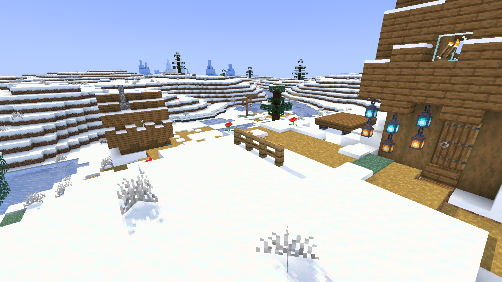
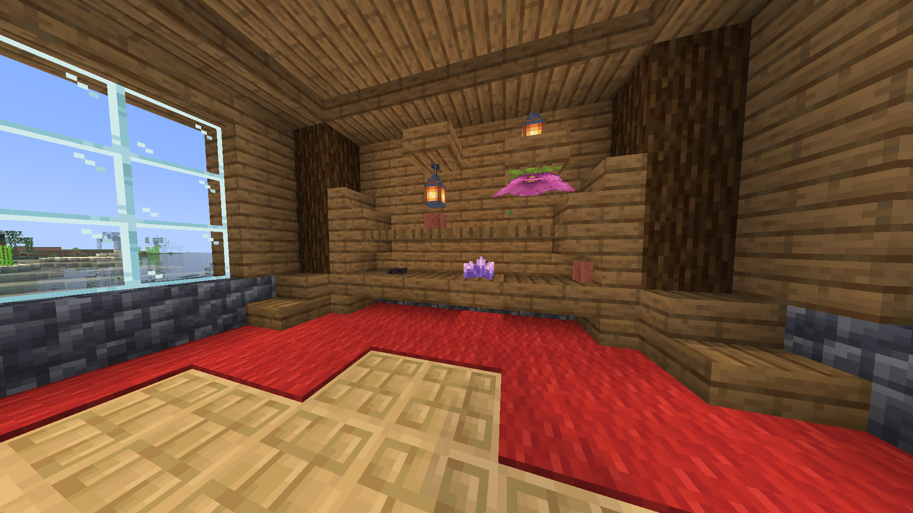
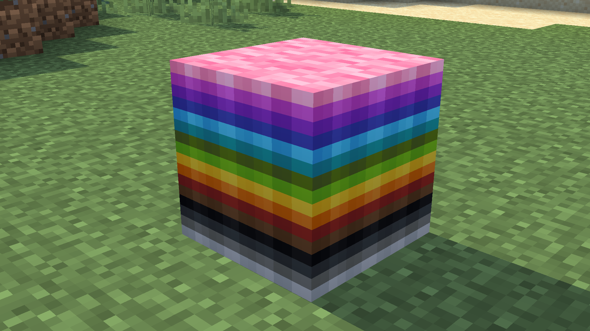
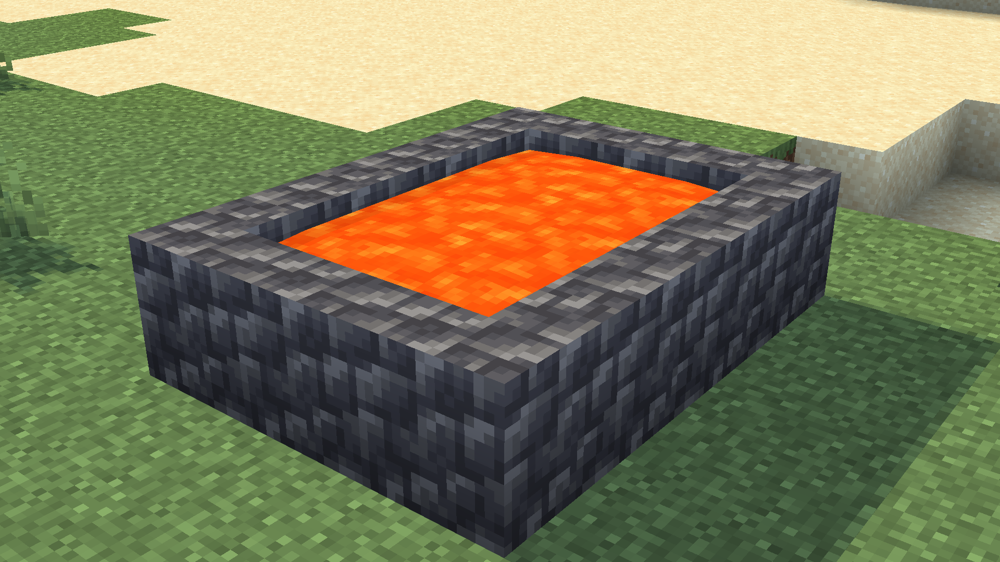
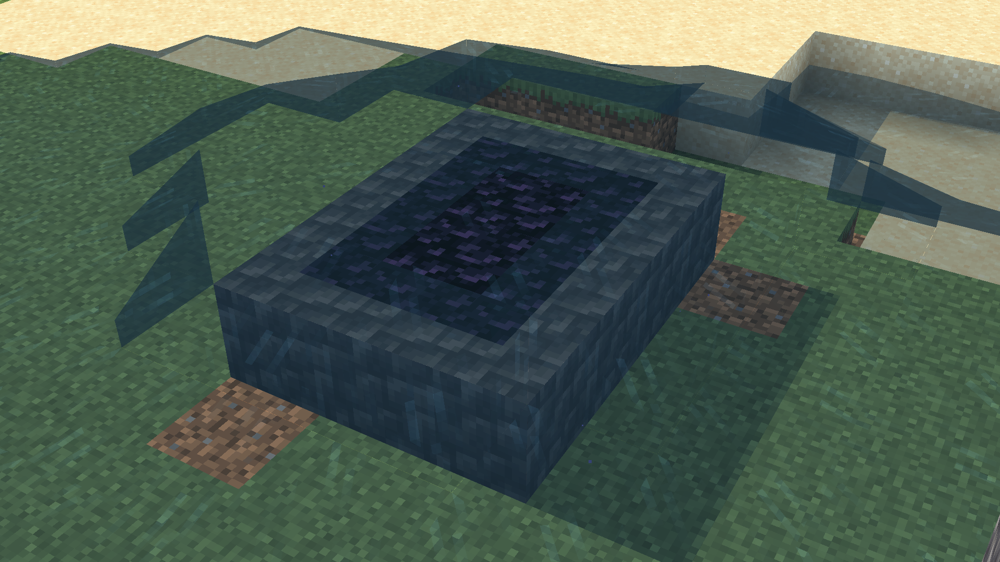

<p align="center">
  
</p>

<h1 align="center">No More Gap</h1>

<p align="center"><strong>Place compatible Minecraft blocks together in the same cell.</strong></p>

No More Gap is an experimental Fabric mod for Minecraft 26.1.2 that allows several blocks to occupy the same space.

Normally, Minecraft only allows one block per cell: placing a torch, plant, or door prevents a snow layer or carpet from being placed there. No More Gap quietly replaces that cell with a **composite block** that stores each element separately. To the player, those blocks should still look, sound, and behave as much like their vanilla equivalents as possible.

Examples:

- place a carpet or snow layer at the feet of a plant, torch, or door;
- stack compatible blocks in a single composite column;
- keep water or lava inside compatible blocks;
- use a lever, redstone lamp, or copper bulb inside the same composite;
- select and break an individual part of a composite.

The mod is still experimental: it changes several core Minecraft behaviours, and compatibility with other mods is not guaranteed in every situation.



## Gallery

| Compact interiors | Carpet stacking |
|---|---|
|  |  |

| Lava logging | Obsidian logging reaction |
|---|---|
|  |  |

## Features

### Composite blocks

- Up to 64 parts in one composite.
- Positions are serialized as fixed-point coordinates with 256 units per block; normal placement advances in 1/16-block pixel increments.
- Collision, selection, occlusion, sounds, particles, and drops are calculated from the part that was actually targeted.
- Selection outlines can surround a part that spans several block cells.
- Doors, trapdoors, gates, stairs, plants, and other neighbour-dependent blocks are updated inside a composite.
- Individual parts can be broken in Survival and Creative mode.
- Faulty parts are quarantined on sensitive paths to reduce crashes caused by incompatible block states.

### Carpets and snow at block feet

A carpet or snow layer can share the cell of a non-full block, such as a plant, torch, or door. Breaking the cover does not automatically break the block it surrounds.

In cold biomes, world generation can automatically place snow at the feet of vegetation. The grass below then becomes snowy. By default, one-block vegetation loses its biome tint to look white; two-block-tall plants keep their tint on both halves.

### Fluids

- Waterlogging is extended to compatible composite parts.
- Lava logging is available for blocks that can contain a fluid.
- Placing a compatible block in a lava source creates it already lava-logged.
- A water/lava reaction can turn a lava-logged part into an “obsidian logged” part.
- Light, exposed fluid state, and neighbour ticks are propagated by the composite block.

### Redstone and interactions

- Direct and indirect redstone signals are forwarded through composite parts.
- Levers can be used inside a composite.
- Redstone lamps and copper bulbs update from received power.
- A lever can power a lamp stored in the same composite.
- Doors, trapdoors, and gates can be opened individually.

### Rendering and performance

Static parts are emitted into chunk buffers instead of being redrawn by a block entity renderer every frame. Render data is immutable and cached by geometry, cell, and position so biome tints and vanilla random offsets are preserved.

A dynamic renderer remains in use for cases that need it, including certain formed reactions and breaking animations. Cells extending beyond the source block are represented by invisible proxies to keep collision, selection, and culling correct.

## Configuration

On first launch, the mod creates `config/no_more_gap.properties`. Changes require restarting the game or server.

| Property | Default | Values | Effect |
|---|---:|---:|---|
| `composite_render_distance_chunks` | `0` | `0` to `64` | Maximum composite render distance. `0` follows Minecraft’s render distance. |
| `max_composite_parts_default` | `64` | `2` to `64` | Initial value of the gamerule that limits part count. |
| `do_lava_logging_reactions_default` | `true` | `true` / `false` | Initial value of the lava/water reaction gamerule. |
| `snow_logged_vegetation_biome_tint` | `false` | `true` / `false` | `false` makes one-block vegetation surrounded by snow white; `true` keeps the biome colour. |
| `snowy_vegetation_generation` | `true` | `true` / `false` | Adds snow at vegetation feet while generating new cold-biome chunks. |

Example:

```properties
composite_render_distance_chunks=0
max_composite_parts_default=64
do_lava_logging_reactions_default=true
snow_logged_vegetation_biome_tint=false
snowy_vegetation_generation=true
```

### Gamerules

The configuration-file values are only defaults used when a world is created. They can then be changed per world:

```mcfunction
/gamerule no_more_gap:max_composite_parts 64
/gamerule no_more_gap:do_lava_logging_reactions true
```

- `no_more_gap:max_composite_parts` accepts values from `2` to `64`.
- `no_more_gap:do_lava_logging_reactions` enables or disables lava-logging reactions.

## Advancements

The mod includes small advancements in English and French:

- **It Fits!** - put at least two blocks in one cell.
- **At the Block’s Feet** - place a cover at a block’s feet.
- **Carpet Diem** - stack 16 carpets in a composite.
- **A Very Hot Bath** - use lava logging.
- **Obsidian Log** - trigger the obsidian-logging reaction.
- **Compact Circuit** - power a lamp from the same composite.
- **Open to Everything** - make a door and carpet share a cell.
- **A Stack of a Stack** - fill a composite with 64 parts.

## Installation

### Minecraft 26.1.2

Requirements:

- Minecraft `26.1.2`;
- Fabric Loader `0.19.3` or compatible;
- Fabric API `0.155.2+26.1.2` or compatible;
- Java 25.

Put the mod JAR and Fabric API in the `mods` folder of both the client and server. The mod must be installed on both sides.

### Minecraft 1.21 to 1.21.11

Dedicated builds are available in `versions/1.21/build/libs/`. Use the JAR whose filename exactly matches your Minecraft version. These builds require Java 21, Fabric Loader 0.19.3, and the matching Fabric API release.

## Building the mod

### Development requirements

- JDK 25;
- `JAVA_HOME` pointing to that JDK;
- an Internet connection on the first launch to download Gradle, Minecraft, Fabric Loom, and dependencies.

The Gradle Wrapper included in this repository provides the correct Gradle version.

On Windows:

```powershell
.\gradlew.bat test
.\gradlew.bat build
```

On Linux or macOS:

```bash
./gradlew test
./gradlew build
```

JAR files are generated in `build/libs/`. Install the file without the `-sources` suffix.

To build every Minecraft 1.21 variant on Windows:

```powershell
.\gradlew.bat -p versions\1.21 buildAllMinecraft121
```

The 1.21 JAR files are generated in `versions/1.21/build/libs/`.

Useful tasks:

| Task | Purpose |
|---|---|
| `build` | Compiles, tests, and produces JAR files. |
| `test` | Runs JUnit tests. |
| `runClient` | Starts a Fabric development client in `run/`. |
| `runServer` | Starts a Fabric development server. |
| `clean` | Removes build output. |

The project uses Fabric Loom split source sets: shared code lives in `src/main`, while rendering and strictly client-side mixins live in `src/client`.

## Development commands

The following commands require operator permission. `/nmg` and `/no_more_gap` are aliases.

```mcfunction
/nmg debug inspect
/nmg debug add_test_part
/nmg debug clear
/nmg debug stress_test [radius]
/nmg debug clear_stress_test [radius]
```

- `inspect` shows the targeted composite’s parts and revision;
- `add_test_part` adds a test part;
- `clear` empties the targeted composite;
- `stress_test` generates an area of composites, each containing 64 carpets;
- `clear_stress_test` removes only composites created by the stress test.

These commands are intended for diagnostics and performance measurements, not normal gameplay.

## Technical architecture

### Data representation

`CompositeBlockEntity` is the source of truth. It owns a `PartContainer` containing `PartInstance` values. Each part stores:

- a stable local identifier;
- the original vanilla `BlockState`;
- a `LocalTransform` with fixed-point translation and quarter-turn rotation;
- flags reserved for special behaviours.

Coordinates use 256 units per block, or 16 units per Minecraft pixel. The technical and serialized limit is 64 parts per composite; the gamerule may impose a lower gameplay limit.

### Source block and proxies

The `no_more_gap:composite` block contains the main block entity. When a part extends into another cell, invisible `no_more_gap:composite_proxy` blocks are placed in the affected cells. Each proxy points to and forwards work to the source block:

```text
interaction with a proxy cell
        → resolve the source block
        → raycast the parts in that cell
        → interact with the exact part
```

Proxies do not duplicate the part list and do not create drops. They provide collision, selection, break prediction, and rendering separation between cells.

### Placement and breaking

`CompositePlacementHandler` intercepts compatible placement. It replaces the existing block with a composite, then stores the original state and the new block as two parts. Batched updates prevent geometry and proxies from being rebuilt after every addition.

`PartRaycaster` transforms each part shape, limits the search to the targeted cell when appropriate, and chooses the closest intersection. Breaking then uses that part’s transformed position, state, sound, particles, and loot table.

When only one full block remains, the composite is converted back into the vanilla block. When nothing remains, the source and its proxies are removed.

### Geometry and caching

`ShapeTransformer` applies translations and rotations to vanilla shapes. `CompositeGeometryCache` merges and stores collision, selection, and occlusion shapes separately. The cache is invalidated only when the content revision changes.

This common geometry is reused by the source block, proxies, raycasting, and several interactions, avoiding repeated shape unions.

### Client rendering

`CompositeChunkModel` emits vanilla part models directly into the chunk mesh. In each cell, it only produces quads owned by that cell. It then applies:

- local translation and rotation;
- the block’s vanilla random offset;
- biome tint, or its removal for snowy vegetation;
- the part’s materials and particle textures.

`CompositeBlockEntityRenderer` is reserved for dynamic elements and breaking animations. Renderer data is transferred as immutable `CompositeRenderData` snapshots so the chunk-build thread never reads a block entity while it is being changed.

### Vanilla states, redstone, and fluids

`CompositePartUpdater` simulates neighbour updates for stored states. Calls that would normally modify a world block are redirected to the matching part. This lets doors, stairs, levers, lamps, and bulbs retain their vanilla properties.

The composite block also aggregates redstone signals, light emission, and the fluid exposed by its parts. Lava logging adds a property to compatible waterloggable blocks and reuses vanilla fluid-state, tick, and reaction paths where possible.

### Mixins

Mixins are restricted to cases where Fabric APIs or block overrides are insufficient:

- adding and propagating fluid properties;
- redirecting neighbour updates and scheduled ticks;
- supporting plants and doors above a composite;
- client prediction, terrain particles, and proxy breaking animations.

`src/main/resources/no_more_gap.mixins.json` is the reference list of active injections.

### World generation

`SnowyVegetationFeature` is placed during the `TOP_LAYER_MODIFICATION` step of Overworld biomes. It uses the vanilla `MOTION_BLOCKING` heightmap, checks whether a column is cold enough, then converts exposed vegetation into a composite containing the plant and a snow layer. It only affects chunks generated while the option is enabled.

## Source layout

```text
src/main/java/fr/xerneas02/nomoregap/
├── block/        composite blocks and block entities
├── geometry/     transforms and shape caching
├── interaction/  placement, raycasting, breaking, and updates
├── lava/         lava logging and reactions
├── part/         part storage and serialization
├── rule/         gamerules
├── config/       configuration file
├── worldgen/     snow-at-vegetation generation
├── mixin/        common injections
└── registry/     blocks, items, and block entity registration

src/client/java/fr/xerneas02/nomoregap/
├── render/       chunk models and block entity renderer
└── mixin/client/ client-only injections
```
## Inspiration

No More Gap was developed independently, but the project was inspired in part by existing approaches to multipart blocks and extended block occupancy, including Vanilla Parts, CB Multipart, Snow! Real Magic!, and Fluidlogged. No source code from these projects is currently included in No More Gap.

## License

Licensed under the GNU General Public License v3.0 only (`GPL-3.0-only`). See [LICENSE](LICENSE).
