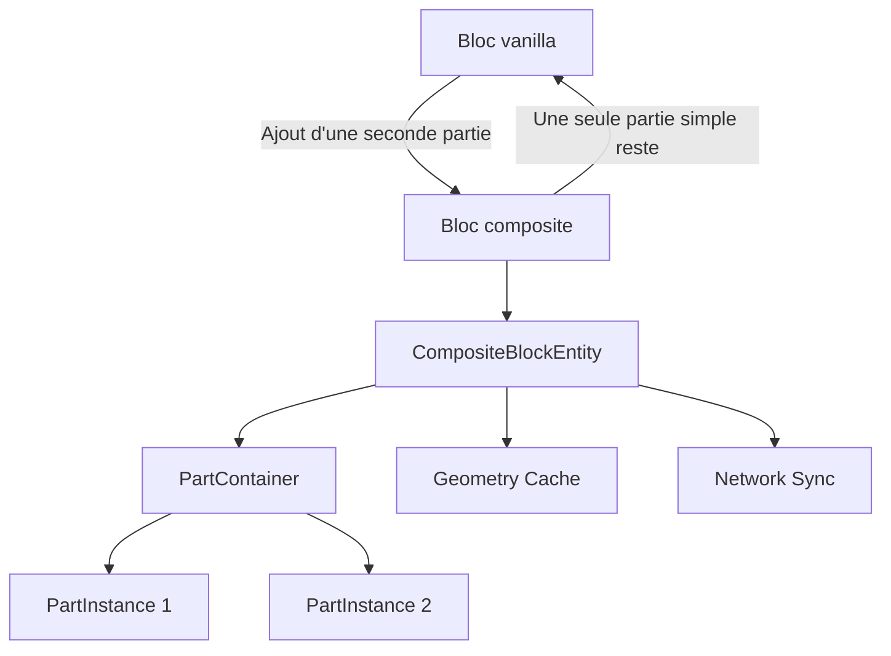

# Architecture

Un bloc conteneur représente la cellule ; sa `CompositeBlockEntity` passive conserve les `PartInstance`. Cela évite des milliers de variantes `BlockState` et tout travail périodique : aucun ticker n’est enregistré. Une modification incrémente la révision, invalide la géométrie, marque la block entity et déclenche sa synchronisation.

Chaque partie associe un `BlockState`, un identifiant local, des flags et un `LocalTransform` déterministe. Les translations persistées sont entières (256 unités par bloc, 16 par pixel) et la rotation est limitée aux quarts de tour. Le cache sépare collision, sélection, occlusion et supports ; il n’est recalculé qu’après invalidation.

Le code commun ne référence aucune classe client. Le renderer, dans le source set client, affiche provisoirement la première partie via le pipeline 26.1.2. La synchronisation initiale utilise le paquet vanilla borné de block entity ; les schémas custom payload préparent les intentions futures et imposent 16 parties au décodage.

La restauration du bloc vanilla quand une partie simple reste, ainsi que les systèmes neige/fluides, viendront séparément. Les blocs contenant leur propre block entity ne sont pas pris en charge dans ce socle.

